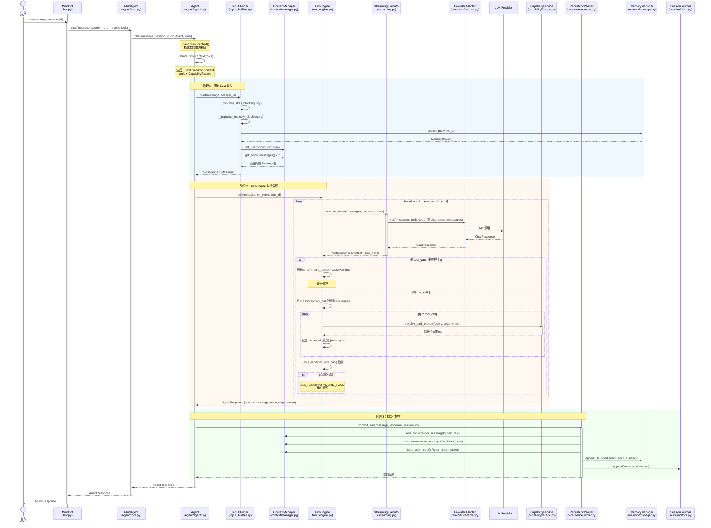
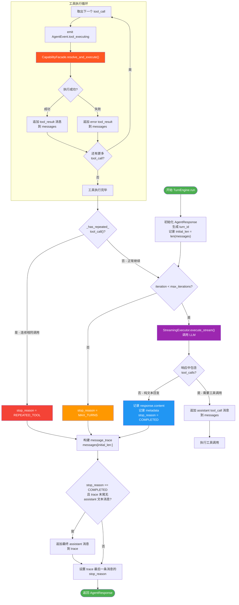
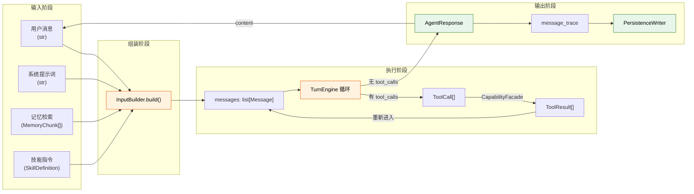

# 执行流程

本文档描述 MindBot 从用户输入到最终响应的完整执行路径，以及 TurnEngine 内部的迭代循环机制。

## 完整请求流程

以下时序图展示了从用户发送消息到获得响应的完整数据流：

## TurnEngine 迭代循环

TurnEngine 是整个执行流程的核心，负责驱动 "LLM 调用 - 工具执行" 的迭代循环。以下流程图展示了单次迭代的完整决策过程：

## 关键数据模型

以下是执行流程中各步骤涉及的核心数据模型及其流转关系。

### 消息模型（贯穿全流程）

| 模型 | 模块 | 关键字段 | 说明 |
|------|------|---------|------|
| `Message` | `context/models.py` | `role`, `content`, `tool_calls`, `tool_call_id`, `turn_id`, `iteration`, `message_kind`, `provider`, `usage`, `timestamp`, `token_count` | 统一多模态消息格式，贯穿 InputBuilder、TurnEngine、PersistenceWriter |
| `MessageContent` | `context/models.py` | `str` 或 `list[TextPart \| ImagePart]` | 消息内容：纯文本或多模态部件列表 |
| `ToolCall` | `context/models.py` | `id`, `name`, `arguments` | LLM 发起的工具调用请求 |
| `ToolResult` | `context/models.py` | `tool_call_id`, `success`, `content`, `error` | 工具执行结果 |

### 响应模型（L2 编排层）

| 模型 | 模块 | 关键字段 | 说明 |
|------|------|---------|------|
| `AgentResponse` | `agent/models.py` | `content`, `events`, `stop_reason`, `message_trace`, `metadata` | Agent 执行结果，包含消息追踪（权威记录） |
| `AgentEvent` | `agent/models.py` | `type` (EventType), `timestamp`, `data` | 流式事件：thinking / delta / tool_executing / tool_result / complete / error |
| `StopReason` | `agent/models.py` | `COMPLETED`, `MAX_TURNS`, `REPEATED_TOOL`, `ERROR`, `USER_ABORTED`, `APPROVAL_DENIED`, `USER_INPUT_NEEDED` | 循环终止原因枚举 |
| `ChatResponse` | `context/models.py` | `content`, `tool_calls`, `reasoning_content`, `provider`, `finish_reason`, `usage` | LLM Provider 统一响应格式 |

### 能力模型（L4 能力层）

| 模型 | 模块 | 关键字段 | 说明 |
|------|------|---------|------|
| `Capability` | `capability/models.py` | `id`, `name`, `description`, `parameters_schema`, `capability_type`, `backend_id` | 统一能力描述，编排层唯一依赖的能力抽象 |
| `CapabilityQuery` | `capability/models.py` | `capability_id`, `name`, `description_hint`, `capability_type` | 能力查找参数 |

### 上下文块模型（L3 领域层）

| 模型 | 模块 | 关键字段 | 说明 |
|------|------|---------|------|
| `ContextBlock` | `context/manager.py` | `name`, `max_tokens`, `messages` | 单个上下文块，持有消息列表和 token 预算 |
| `ContextManager` | `context/manager.py` | `_blocks` (7 个 ContextBlock), `max_tokens` | 7 块上下文窗口管理器 |

## 数据流转路径

## 停止条件汇总

TurnEngine 循环在以下任一条件满足时终止：

| 停止条件 | StopReason | 触发时机 |
|---------|------------|---------|
| LLM 返回纯文本（无 tool_calls） | `COMPLETED` | 正常完成，最常见的情况 |
| 达到最大迭代次数 | `MAX_TURNS` | 迭代计数达到 `max_iterations`（默认 20） |
| 检测到重复工具调用 | `REPEATED_TOOL` | 连续两次迭代产生了完全相同的工具名称和参数 |
| 执行异常 | `ERROR` | LLM 调用或工具执行过程中抛出不可恢复异常 |
| 用户中止 | `USER_ABORTED` | 用户主动中断执行 |
| 工具审批被拒绝 | `APPROVAL_DENIED` | 需要用户审批的工具调用被拒绝 |
| 审批超时 | `APPROVAL_TIMEOUT` | 等待用户审批超时 |
| 需要用户输入 | `USER_INPUT_NEEDED` | 工具执行过程中需要用户补充信息 |

## message_trace 权威记录

`AgentResponse.message_trace` 是 TurnEngine 在一次执行中产生的所有消息的权威记录，按时间顺序排列，包含：

1. **assistant tool_call 消息**：LLM 请求调用工具时的 assistant 消息（`message_kind="assistant_tool_call"`）
2. **tool_result 消息**：工具执行结果（`message_kind="tool_result"`）
3. **最终 assistant 消息**：LLM 的最终文本回复（`message_kind="assistant_text"`）

每条 trace 消息都携带 `turn_id`、`iteration`、`provider`、`usage` 等元数据，用于持久化、日志记录和可观测性。
