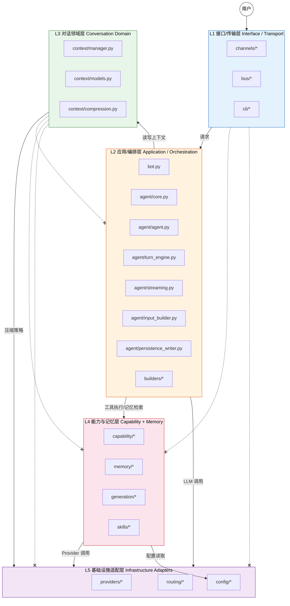

# 架构概览

MindBot 采用 **五层分层架构**，从上到下依次为接口传输层、应用编排层、对话领域层、能力与记忆层、基础设施适配层。各层之间通过明确的边界规则和单向依赖关系进行解耦。

## 五层架构图



## 各层职责说明

| 层级 | 名称 | 核心职责 | 关键模块 |
|------|------|---------|---------|
| L1 | 接口/传输层 | 接入外部通道（CLI、HTTP、飞书等），通过 MessageBus 解耦消息收发 | `channels/*`, `bus/*`, `cli/*` |
| L2 | 应用/编排层 | 对话主链路编排：组装输入、驱动 TurnEngine 循环、持久化提交 | `bot.py`, `agent/core.py`, `agent/agent.py`, `agent/turn_engine.py`, `agent/streaming.py`, `agent/input_builder.py`, `agent/persistence_writer.py`, `builders/*` |
| L3 | 对话领域层 | 纯状态与压缩：7 块上下文窗口管理、消息模型、token 预算分配 | `context/manager.py`, `context/models.py`, `context/compression.py` |
| L4 | 能力与记忆层 | 工具执行、记忆检索、动态工具生成、技能注册与渲染 | `capability/*`, `memory/*`, `generation/*`, `skills/*` |
| L5 | 基础设施适配层 | LLM Provider 适配、模型路由选择、配置加载与热更新 | `providers/*`, `routing/*`, `config/*` |

## 层间边界规则

| 调用方 | 被调用方 | 允许 | 说明 |
|--------|---------|------|------|
| L1 | L2 | :white_check_mark: | 通道层调用 `MindBot.chat()` / `chat_stream()` |
| L2 | L3 | :white_check_mark: | 编排层读写上下文、管理对话块 |
| L2 | L4 | :white_check_mark: | 编排层通过 CapabilityFacade 调度工具，通过 MemoryManager 检索记忆 |
| L2 | L5 | :white_check_mark: | 编排层通过 ProviderAdapter 发起 LLM 调用 |
| L3 | L5 | :white_check_mark: | 仅 SummarizeStrategy/ExtractStrategy 调用 LLM 做压缩 |
| L4 | L5 | :white_check_mark: | 动态工具生成需要 LLM 调用；配置读取 |
| L1 | L4 | :x: | 禁止：通道层不得直接执行工具 |
| L1 | L5 | :x: | 禁止：通道层不得直接调用 Provider |
| L3 | L2 | :x: | 禁止：对话领域层不得反向调用编排层 |
| L3 | L4 | :x: | 禁止：对话领域层不得直接调用工具或记忆 |
| L3 | L5 | :x: | 禁止：对话领域层不得直接调用 Provider（压缩策略除外） |

## 铁律（Iron Rules）

以下设计约束为架构硬性规则，不可绕过或变更：

### 铁律 1：仅两个聊天接口

对外暴露且仅暴露两个入口方法：`chat()` 和 `chat_stream()`。所有通道（CLI、HTTP、飞书等）必须且只能通过这两个方法进入主链路。

```
MindBot.chat()       -> 非流式，返回 AgentResponse
MindBot.chat_stream() -> 流式，AsyncIterator[str]
```

### 铁律 2：主链路不可绕过

完整的请求必须经过统一主链路：

```
chat() -> _build_turn_context() -> _run_turn() -> InputBuilder.build() -> TurnEngine.run() -> PersistenceWriter.commit_turn()
```

任何通道或调用方都不得跳过其中某个环节直接访问底层组件。

### 铁律 3：全异步架构

所有 I/O 操作（LLM 调用、工具执行、记忆检索、文件读写）均为 `async` 函数。同步阻塞操作通过 `run_sync()` 包装器隔离，不得在主链路上阻塞事件循环。

### 铁律 4：7 块上下文管理（Block-based Context）

ContextManager 将上下文窗口严格划分为 7 个块，每个块有独立的 token 预算：

| 块名称 | 默认预算比例 | 用途 |
|--------|------------|------|
| `system_identity` | 12% | 系统提示词 / 人设 |
| `skills_overview` | 8% | 技能概览摘要 |
| `skills_detail` | 15% | 选中技能的详细指令 |
| `memory` | 15% | 检索到的记忆片段 |
| `conversation` | 35% | 多轮对话历史（可压缩） |
| `intent_state` | 5% | 当前轮次的意图/状态提示 |
| `user_input` | 10% | 当前用户输入 |

### 铁律 5：工具签名失效机制

当工具集合发生变化（新增、替换、删除）时，通过 `_get_tool_signature()` 计算工具集合的指纹（`frozenset[(name, id)]`），与缓存签名比对。签名不一致时重建 TurnEngine，确保 LLM 每次看到的工具列表与实际可执行的工具完全一致。

### 铁律 6：CapabilityFacade 统一调度

所有工具执行必须通过 `CapabilityFacade.resolve_and_execute()` 完成。TurnEngine 不直接调用 ToolRegistry 或任何后端，而是统一经由 CapabilityFacade 做解析和路由。这保证了静态工具、动态工具、技能、MCP 工具使用同一条执行路径。

### 铁律 7：重复工具检测

TurnEngine 在每次迭代后检查 `_has_repeated_tool_call()`：如果连续两次迭代产生了完全相同的工具名称和参数列表，立即以 `StopReason.REPEATED_TOOL` 终止循环，防止无限循环。

## 核心类快速参考

| 类名 | 所在模块 | 所属层 | 职责 |
|------|---------|-------|------|
| `MindBot` | `bot.py` | L2 | 顶层入口，持有 MindAgent，对外暴露 chat/chat_stream |
| `MindAgent` | `agent/core.py` | L2 | 监督者 Agent，管理主 Agent 和子 Agent 注册表 |
| `Agent` | `agent/agent.py` | L2 | 自包含会话 Agent，管理会话缓存（LRU）、工具注册、TurnEngine |
| `TurnEngine` | `agent/turn_engine.py` | L2 | 单回合执行引擎，驱动 LLM 调用-工具执行循环 |
| `StreamingExecutor` | `agent/streaming.py` | L2 | Provider 级流式适配器，封装流式/非流式调用 |
| `InputBuilder` | `agent/input_builder.py` | L2 | 从 ContextManager 和 MemoryManager 组装每轮 LLM 输入 |
| `PersistenceWriter` | `agent/persistence_writer.py` | L2 | 统一持久化入口：上下文写入、记忆追加、日志记录 |
| `ContextManager` | `context/manager.py` | L3 | 7 块上下文窗口管理，token 预算分配与压缩触发 |
| `CapabilityFacade` | `capability/facade.py` | L4 | 统一能力 API，组合 Registry（解析）和 Executor（执行） |
| `ScopedCapabilityFacade` | `capability/facade.py` | L4 | 回合级能力视图，支持工具临时覆盖 |
| `MemoryManager` | `memory/manager.py` | L4 | 双记忆系统门面：短期（临时）+ 长期（持久） |
| `DynamicToolManager` | `generation/dynamic_manager.py` | L4 | 运行时动态工具生成、注册、持久化和刷新 |
| `SkillRegistry` | `skills/registry.py` | L4 | 技能注册表，存储和解析已加载的技能定义 |
| `ProviderAdapter` | `providers/adapter.py` | L5 | 统一 Provider 适配器，隐藏底层差异 |
| `ModelRouter` | `routing/router.py` | L5 | 模型路由：根据复杂度、关键词规则、能力选择最佳模型 |
| `Message` | `context/models.py` | L3 | 统一多模态消息格式，贯穿所有模块 |
| `AgentResponse` | `agent/models.py` | L2 | Agent 执行结果：内容、事件列表、停止原因、消息追踪 |
| `AgentEvent` | `agent/models.py` | L2 | 流式事件：thinking、delta、tool_executing、complete 等 |

## 扩展点

| 扩展点 | 所在层 | 扩展方式 | 说明 |
|--------|-------|---------|------|
| 新增通道（如 Telegram、Discord） | L1 | 实现 `BaseChannel` 子类 | 注册到 ChannelManager 即可接入 |
| 自定义压缩策略 | L3 | 继承 `CompressionStrategy` | 实现 `compress()` 方法，支持 truncate/summarize/extract/mix/archive |
| 新增 LLM Provider | L5 | 继承 `Provider` 基类 | 通过 ProviderFactory 注册，配置文件中声明即可使用 |
| 新增工具 | L4 | 注册到 `ToolRegistry` 或使用 `DynamicToolManager` | 支持静态注册和运行时动态生成 |
| 新增技能 | L4 | 编写 SKILL.md 并放入 skills 目录 | 通过 SkillLoader 自动加载，SkillSelector 按触发条件匹配 |
| 新增路由规则 | L5 | 在 `settings.json` 中添加 routing.rules | 支持关键词匹配、复杂度分级、能力优先（如视觉模型） |
| 新增能力后端（如 MCP） | L4 | 继承 `ExtensionBackend` | 通过 `CapabilityFacade.add_backend()` 注册 |
| 子 Agent 委派 | L2 | `MindAgent.register_child_agent()` | 注册后可通过主 Agent 进行任务分派 |
| 会话日志后端 | L2 | 实现 `SessionJournal` | 替换默认 JSONL 存储为数据库或其他持久化方式 |
| 配置热更新 | L5 | 使用 `ConfigStore` | 通过文件监视实现运行时配置变更，自动重建 Agent |
